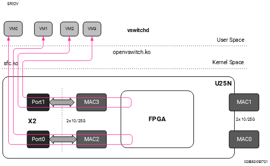

# 4 Detailed Applications Description

## 4.1 Legacy and Switchdev Modes

### 4.1.1 Legacy NIC (Default)

In legacy mode packets from the external MAC0 are forwarded to the internal MAC2 without any modifications on flow entry miss, and vice versa. Similarly, packets from the external MAC1 are forwarded to the internal MAC3 without any modifications on flow entry miss, and vice versa. OVS is not supported in this configuration.

*Figure 5:* **Legacy Mode**


### 4.1.2 Switchdev Mode

When changed to the switchdev mode, the U25N can support OVS switching. Devlink features are added to the PF0 interface in each adapter to support the switch mode. Switchdev mode can be added for a single adapter or both. A new representor network interface comes up for each VF when a VM is connected to the VF via SR-IOV virtual ports provided by X2 VNICs.

*Figure 6:* **Switchdev Mode**


## 4.2 OVS

### 4.2.1 Installing OVS

OVS is a multilayer software switch licensed under the open source Apache 2 license. It implements a production quality switch platform that supports standard management interfaces and opens the forwarding functions to programmatic extension and control. OVS is well suited to function as a virtual switch in virtualized environments.

Follow the below-mentioned steps to install OVS. For additional infomation of OVS installation, please refer to [Installing Open vSwitch](https://docs.openvswitch.org/en/latest/intro/install/index.html)

1. The OVS source code is available in its Git repository
   ```bash
   git clone https://github.com/openvswitch/ovs.git
   ```

2. After cloning, the ovs directory will be in the current directory path. "cd" to the ovs directory as mentioned below:

   ```bash
   cd ovs
   ```

3. Execute the following commands sequentially as the root user:

   ```bash
   ./boot.sh
   ./configure
   make
   make install
   ```

4. Export the OVS path:

   ```bash
   export PATH=$PATH:/usr/local/share/openvswitch/scripts
   ```

5. Perform a version check:

   ```bash
   ovs-vswitchd --version
   ```

   ***Note*:** Version 2.12 and 2.14 have been tested.

Maximum flows supported and tested: 8k

### 4.2.2 Classification Fields (Matches)

Supported Keys and Actions

```text
Keys

1. ipv4/ipv6 src_ip

2. ipv4/ipv6 dst_ip

3. ip_tos

4. ip_proto

5. ovlan Outer

6. ivlan Inner

7. ether_type

8. tcp/udp src_port

9. tcp/udp dst_port

10. src_mac

11. dst_mac

12. vni

13. Ingress port

Actions

1. do_decap

2. do_decr_ip_ttl

3. do_src_mac

4. do_dst_mac

5. do_vlan_pop

6. do_vlan_push

7. do_encap

8. do_deliver

9. mod_vlan_vid
```

### 4.2.3 Port to Port

In this configuration the U25N PF is added to the OVS bridge as an interface. Packets are sent to an external MAC, and OVS performs the switching based on the packets received.

*Figure 7:* **Port to Port setup**


- Step 1. Refer to [Basic Requirements and Component Versions Supported](./ug1534-installation.html#basic-requirements-and-component-versions-supported) for the required OS/software version.

- Step 2. Check the driver version of U25N interface using the following command:

   ***Note*:** Ignore this step, if the U25N driver version is [latest](./ug1534-installation.html#basic-requirements-and-component-versions-supported).

   ```bash
   ethtool -i u25eth0 | grep version
   ```

   ***Note*:** To install the latest sfc driver, refer to [U25N Driver](./ug1534-installation.html#u25n-driver).

- Step 3. Put both U25N PF interfaces in ready state:

   1. List the interfaces
      ```bash
      ifconfig -a
      ```

   2. Search for U25N interfaces using the `ethtool -i <interface_name>` command:

      ```bash
      sfboot --list # shows the U25N interfaces
      ```
      Example Output:
      ```
      Adapter list:
         u25eth0
         u25eth1
      ```

   3. Bring U25N interfaces up

      ```
      ifconfig <PF_interface> up
      ```

      For example:

      ```bash
      ifconfig u25eth0 up
      ifconfig u25eth1 up
      ```

- Step 4. Put the U25N PF interfaces into switchdev mode:

   ***Note*:** Ensure that the PF interface link is up before switching to switchdev mode.

   The `lspci | grep Sol` command gives us the PCIe® device bus ID required to execute the following command.

   ```bash
   devlink dev eswitch set pci/0000:<pci_id> mode switchdev # pci_id is the BDF of U25N Device
   ```

   Example Output:

   ```bash
   devlink dev eswitch set pci/0000:af:00.0 mode switchdev
   devlink dev eswitch set pci/0000:af:00.1 mode switchdev
   ```

- Step 5. Follow the steps mentioned in [OVS Configuration](./ug1534-detailedappsdescriptions.html#ovs-configuration) to create an OVS bridge. After creating the OVS bridge, continue with the next step.

- Step 6. Add external ports to the OVS bridge:

   ```bash
   ovs-vsctl add-port <bridge_name> <PF_interface>
   ```

   For example:

   ```bash
   ovs-vsctl add-port br0 u25eth0
   ovs-vsctl add-port br0 u25eth1
   ```

- Step 7.  a brief overview of the OVS database contents using the following command:

   ```bash
   ovs-vsctl show
   ```

Refer to [Functionality Check](./ug1534-detailedappsdescriptions.html#functionality-check) to check the OVS functionality.

### 4.2.4 Port to VM or VM to Port

***Note*:** To have this configuration SR-IOV must be enabled in BIOS. For the Port to VM or VM to Port configuration, a tunnel L2GRE or VXLAN could be created with two server setups.

*Figure 8:* **Port to VM or VM to Port setup**


- Step 1. Refer to [Basic Requirements and Component Versions Supported](./ug1534-installation.html#basic-requirements-and-component-versions-supported) for the required OS/software version.
   
   For VM use cases, VFs need to be created for the corresponding PF for binding to the VM. The number of VF counts should be configured by the sfboot command with sriov_numvfs.

   ***Note*:** For more information, refer to [sfboot Configuration](./ug1534-installation.html#sfboot-configuration).

- Step 2. Check the driver version of U25N interface using the following command:

   ***Note*:** Ignore this step, if the U25N driver version is [latest](./ug1534-installation.html#basic-requirements-and-component-versions-supported).

   ```bash
   ethtool -i u25eth0 | grep version
   ```
   ***Note*:** To install the latest sfc driver, refer to [U25N Driver](./ug1534-installation.html#u25n-driver).

- Step 3. Put both U25N PF interfaces in ready state:

   1. List the interfaces
      ```bash
      ifconfig -a
      ```

   2. Search for U25N interfaces using the `ethtool -i <PF_interface>` command:

      ```bash
      sfboot --list # shows the U25N interfaces
      ```
      Example Output:
      ```
      Adapter list:
         u25eth0
         u25eth1
      ```

   3. Bring U25N interfaces up

      ```
      ifconfig <PF_interface> up
      ```

      For example:

      ```bash
      ifconfig u25eth0 up
      ifconfig u25eth1 up
      ```

- Step 4. Enable desired VFs to the U25N PF. In the following command, a single VF is enabled on the PF0 interface:

   ***Note*:** The VF could also be created on the PF1 interface based on the use case. The sriov_numvfs count should be less than or equal to the VF count specified in the sfboot command. The sriov_numvfs should be enabled only in legacy mode. To check the U25N mode, excecute the following steps.

   ```bash
   devlink dev eswitch show pci/0000:<pci_id> # pci_id is the BDF of U25N Device
   ```

   Example Output:
   ```bash
   pci/0000:af:00.0 mode legacy
   ```

   If not in legacy mode, change to legacy mode using the following command:

   ```bash
   devlink dev eswitch set pci/0000:<PCIe device bus id> mode legacy
   ```

   Enable desired number of VFs.
   ```bash
   echo 1 > /sys/class/net/<PF_interface>/device/sriov_numvfs
   ```

   For example:

   ```bash
   echo 1 > sys/class/net/u25eth0/device/sriov_numvfs
   ```

   ***Note*:** After executing above mentioned command, a VF PCIe ID and VF interface will be created. The VF PCIe device ID can be listed with the command `lspci -d 1924:1b03`.

   An example of the device ID is
   ```bash
   af:00.2 Ethernet controller: Solarflare Communications XtremeScale SFC9250 10/25/40/50/100G Ethernet Controller (Virtual Function) (rev 01). 
   This VF PCIe ID is used for binding the VF to a VM.
   ```
- Step 5. The VF interface can be found using the `ifconfig -a` command. To differentiate VF from PF, use the ip link show command. This gives the VF interface ID and VF interface mac address under the PF interface.

- Step 6. Ensure that the VF interface is up:

   ```bash
   ifconfig <VF_interface> up
   ```

- Step 7. Ensure that the PF interface is in switchdev mode:

   ***Note*:** Ensure the PF interface link is up before doing switchdev mode.

   The `lspci | grep Sol` command gives the PCIe device bus ID.

   ```bash
   devlink dev eswitch set pci/0000:<pci_id> mode switchdev # pci_id is the BDF of U25N Device
   ```

   For example:
   ```bash
   devlink dev eswitch set pci/0000:af:00.0 mode switchdev
   ```

- Step 8. Running the above command creates a VF representor interface. The VF representor interface name will be the PF interface name followed by `_0` for the first VF representor and `_1` for the second V representor, and so on.

   ***Note*:**The total number of VF representor interfaces created are based on the sriov_numvfs value configured above.

   ```bash
   ip link show | grep <PF_interface>
   ```

   For example:
   ```bash
   ip link show | grep u25eth0
   ```

   ***Note*:** Here u25eth0 is the PF interface and u25eth0_0 is the VF representor interface.

   Now make the VF representor interface up using the ifconfig command:

   ```bash
   ifconfig <VF_rep_interface> up
   ```

- Step 9. Follow the steps mentioned in [OVS Configuration](./ug1534-detailedappsdescriptions.html#ovs-configuration) to create an OVS bridge. After creating the OVS bridge, proceed to the next step.

- Step 10. Add PF interfaces as ports to the OVS bridge:

    ```bash
    ovs-vsctl add-port <bridge_name> <PF0_interface>
    ```

    For example:
    ```bash
    ovs-vsctl add-port br0 u25eth0
    ```

- Step 11. Add a VF representor interface as a port to the OVS bridge:

    ```bash
    ovs-vsctl add-port <bridge_name> <VF_rep_interface>
    ```

   For example:
    ```bash
    ovs-vsctl add-port br0 u25eth0_0
    ```

- Step 12. Ensure that the the OVS bridge is up:

    ```bash
    ifconfig <bridge_name> up
    ```

- Step 13. Print a brief overview of the database contents:

    ```bash
    ovs-vsctl show
    ```

- Step 14. Refer [VM Installation](./ug1534-vminstall.html#vm-installation) to instantiate the VM.

- Step 15. Refer to [Functionality Check](./ug1534-detailedappsdescriptions.html#functionality-check) to check OVS functionality.

### 4.2.5 VM to VM

***Note*:** To have this configuration SR-IOV must be enabled in BIOS. 

*Figure 9:* **VM to VM setup**



- Step 1. Refer to [Basic Requirements and Component Versions Supported](./ug1534-installation.html#basic-requirements-and-component-versions-supported) for the required OS/software version.
   
   For VM use cases, VFs need to be created for the corresponding PF for binding to the VM. The number of VF counts should be configured by the sfboot command with sriov_numvfs.

   ***Note*:** For more information, refer to [sfboot Configuration](./ug1534-installation.html#sfboot-configuration).

- Step 2. Check the driver version of U25N interface using the following command:

   ***Note*:** Ignore this step, if the U25N driver version is [latest](./ug1534-installation.html#basic-requirements-and-component-versions-supported).

   ```bash
   ethtool -i u25eth0 | grep version
   ```
   ***Note*:** To install the latest sfc driver, refer to [U25N Driver](./ug1534-installation.html#u25n-driver).

- Step 3. Put both U25N PF interfaces in ready state:

   1. List the interfaces
      ```bash
      ifconfig -a
      ```

   2. Search for U25N interfaces using the `ethtool -i <PF_interface>` command:

      ```bash
      sfboot --list # shows the U25N interfaces
      ```
      Example Output:
      ```
      Adapter list:
         u25eth0
         u25eth1
      ```

   3. Bring U25N interfaces up

      ```
      ifconfig <PF_interface> up
      ```

      For example:

      ```bash
      ifconfig u25eth0 up
      ifconfig u25eth1 up
      ```

- Step 4. Enable desired VFs to the U25N PF. In the following command, two VFs are enabled on the PF0 interface:

   ***Note*:** The VF could also be created on the PF1 interface based on the use case. The sriov_numvfs count should be less than or equal to the VF count specified in the sfboot command. The sriov_numvfs should be enabled only in legacy mode. To check the U25N mode, excecute the following steps.

   ```bash
   devlink dev eswitch show pci/0000:<pci_id> # pci_id is the BDF of U25N Device
   ```

   Example Output:
   ```bash
   pci/0000:af:00.0 mode legacy
   ```

   If not in legacy mode, change to legacy mode using the following command:

   ```bash
   devlink dev eswitch set pci/0000:<PCIe device bus id> mode legacy
   ```

   Enable desired number of VFs.
   ```bash
   echo 2 > /sys/class/net/<PF_interface>/device/sriov_numvfs
   ```

   For example:

   ```bash
   echo 2 > sys/class/net/u25eth0/device/sriov_numvfs
   ```

   ***Note*:** After executing above mentioned command, a VF PCIe ID and VF interface will be created. The VF PCIe device ID can be listed with the command `lspci -d 1924:1b03`.

   An example of the device ID is
   ```bash
   af:00.2 Ethernet controller: Solarflare Communications XtremeScale SFC9250 10/25/40/50/100G Ethernet Controller (Virtual Function) (rev 01). 
   This VF PCIe ID is used for binding the VF to a VM.
   ```

- Step 5. The VF interface can be found using the `ifconfig -a` command. To differentiate VF from PF, use the ip link show command. This gives the VF interface ID and VF interface mac address under the PF interface.

- Step 6. Ensure that the VF interface is up:

   ```bash
   ifconfig <VF_interface> up
   ```

- Step 7. Ensure that the PF interfaces are in switchdev mode.

   ***Note*:** Ensure the PF interface link is up before doing switchdev mode.

   The `lspci | grep Sol` command gives the PCIe device bus ID:

   ```bash
   devlink dev eswitch set pci/0000:<PCIe device bus id> mode switchdev
   ```

   For example:
   ```bash
   devlink dev eswitch set pci/0000:af:00.0 mode switchdev
   ```

- Step 8. Running the above command creates two VF representor interfaces. The VF representor interface name will be the PF interface name followed by `_0` for the first VF representor and `_1` for the second V representor, and so on.

   ***Note*:**The total number of VF representor interfaces created are based on the sriov_numvfs value configured above.

   ```bash
   ip link show | grep <PF_interface>
   ```

   For example:
   ```bash
   ip link show | grep u25eth0
   ```

   ```bash
   u25eth0: <BROADCAST,MULTICAST,UP,LOWER_UP> mtu 1500 qdisc mq state UP
   mode DEFAULT group default qlen 1000
   u25eth0_0: <BROADCAST,MULTICAST,UP,LOWER_UP> mtu 1500 qdisc fq_codel
   master ovs-system state UP mode DEFAULT group default qlen 1000
   u25eth0_1: <BROADCAST,MULTICAST,UP,LOWER_UP> mtu 1500 qdisc fq_codel
   master ovs-system state UP mode DEFAULT group default qlen 1000
   ```

   ***Note*:** Here u25eth0 is the PF interface, and u25eth0_0 and u25eth0_1 are the VF representor interfaces.

   Now make the VF representor interfaces up using the ifconfig command:

   ```bash
   ifconfig <VF_rep_interface> up
   ```

- Step 9. Follow the steps mentioned in [OVS Configuration](./ug1534-detailedappsdescriptions.html#ovs-configuration) to create an OVS bridge. After creating the OVS bridge, proceed to the next step.

- Step 10. Add two VF representor interfaces to the OVS bridge:

    ```bash
    ovs-vsctl add-port <bridge_name> <VF_rep_interface 1>
    ovs-vsctl add-port <bridge_name> <VF_rep_interface 2>
    ```

    For example:

    ```
    ovs-vsctl add-port br0 u25eth0_0
    ovs-vsctl add-port br0 u25eth0_1
    ```

- Step 11. Ensure that the the OVS bridge is up:

    ```bash
    ifconfig <bridge_name> up
    ```

- Step 12. Print the brief overview of the database contents:

    ```bash
    ovs-vsctl show
    ```

- Step 14. Refer [VM Installation](./ug1534-vminstall.html#vm-installation) to instantiate the VM.

- Step 15. Refer to [Functionality Check](./ug1534-detailedappsdescriptions.html#functionality-check) to check OVS functionality.

### 4.2.6 Tunnels (Encapsulation/Decapsulation)

U25N Smart NIC supports offloading of tunnels using encapsulation and decapsulation actions.

- **Encapsulation:** Pushing tunnel header is supported on TX

- **Decapsulation:** Stripping tunnel header is supported on RX

Supported tunnels:

- VXLAN

- L2GRE

#### L2GRE

- Maximum tunnel support = 1K

- Maximum supported flows = 8K

- Maximum MTU size = 1400

Refer [Basic Requirements and Component Versions Supported](./ug1534-installation.html#basic-requirements-and-component-versions-supported) for the required OS/software version. An L2GRE tunnel can be formed between two servers. Tunnel endpoint IP should be added to the PF interface which acts as a origin of the tunnel.

*Figure 10:* **L2GRE End to End setup with OVS functionality**


##### **L2GRE Server 1 Configuration**

- Step 1. Refer to [Basic Requirements and Component Versions Supported](./ug1534-installation.html#basic-requirements-and-component-versions-supported) for the required OS/software version.

- Step 2. Check the driver version of U25N interface using the following command:

   ***Note*:** Ignore this step, if the U25N driver version is [latest](./ug1534-installation.html#basic-requirements-and-component-versions-supported).

   ```bash
   ethtool -i u25eth0 | grep version
   ```

   ***Note*:** To install the latest sfc driver, refer to [U25N Driver](./ug1534-installation.html#u25n-driver).

- Step 3. Put both U25N PF interfaces in ready state:

   1. List the interfaces
      ```bash
      ifconfig -a
      ```

   2. Search for U25N interfaces using the `ethtool -i <interface_name>` command:

      ```bash
      sfboot --list # shows the U25N interfaces
      ```
      Example Output:
      ```
      Adapter list:
         u25eth0
         u25eth1
      ```

   3. Bring U25N interfaces up

      ```
      ifconfig <PF_interface> up
      ```

      For example:

      ```bash
      ifconfig u25eth0 up
      ifconfig u25eth1 up
      ```

- Step 4. Assign tunnel local IP to PF0 interface:

   ```bash
   ifconfig <PF0_interface> <local_ip> up
   ```

   For example: 
   ```bash
   ifconfig u25eth0 10.16.0.2/24 up
   ```

- Step 5. Put the U25N PF0 interface into switchdev mode:

   ***Note*:** Ensure that the PF interface link is up before switching to switchdev mode.

   The `lspci | grep Sol` command gives us the PCIe® device bus ID required to execute the following command.

   ```bash
   devlink dev eswitch set pci/0000:<pci_id> mode switchdev # pci_id is the BDF of U25N Device
   ```

   Example Output:

   ```bash
   devlink dev eswitch set pci/0000:af:00.0 mode switchdev
   ```

- Step 6. Follow the steps mentioned in [OVS Configuration](./ug1534-detailedappsdescriptions.html#ovs-configuration) to create an OVS bridge. After creating the OVS bridge, continue with the next step.

- Step 7. Create GRE interfaces:

   ```bash
   ovs-vsctl add-port <bridge_name> gre0 -- set interface gre0 type=gre
   options:local_ip=<ip_address> options:remote_ip=<ip_address>
   ```

   For example:

   ```bash
   ovs-vsctl add-port br0 gre0 -- set interface gre0 type=gre
   options:local_ip=10.16.0.2 options:remote_ip=10.16.0.1
   ```

- Step 8. Add a PF1 interface as a port to the OVS bridge:

   ```bash
   ovs-vsctl add-port <bridge_name> <PF1_interface>
   ```

   For example:

   ```bash
   ovs-vsctl add-port br0 u25eth1
   ```

- Step 9. Ensue the OVS bridge is up:

   ```bash
   ifconfig <bridge_name> up
   ```

   For example:

   ```bash
   ifconfig br0 up
   ```

- Step 10. Print a brief overview of the database contents:

   ```bash
   ovs-vsctl show
   ```

##### **L2GRE Server 2 Configuration**

The setup steps for server 2 is as same as server 1 except for local_ip and remote_ip in step 4 and step 6.

In step 4, the tunnel local IP assigned to PF0 interface should be the tunnel remote IP in above server 1 configuration.

For example:
```bash
ifconfig u25eth0 10.16.0.1/24 up
```

In step 6, the tunnel local IP and remote IP should be swapped in above server 1 configuration.
```bash
ovs-vsctl add-port br0 gre0 -- set interface gre0 type=gre
options:local_ip=10.16.0.1 options:remote_ip=10.16.0.2
```

#### 4.2.6.2 VXLAN

- Maximum tunnel support = 1K

- Maximum supported flows = 8K

- Maximum MTU size = 1400

Refer  [Basic Requirements and Component Versions Supported](./ug1534-installation.html#basic-requirements-and-component-versions-supported) for the required OS/software version. A VXLAN tunnel can be formed between two servers. Tunnel endpoint IP should be added to the PF interface where the tunnel needs to be created.

*Figure 11:* **VXLAN**


##### **VXLAN Server 1 Configuration**

- Step 1. Refer to [Basic Requirements and Component Versions Supported](./ug1534-installation.html#basic-requirements-and-component-versions-supported) for the required OS/software version.

- Step 2. Check the driver version of U25N interface using the following command:

   ***Note*:** Ignore this step, if the U25N driver version is [latest](./ug1534-installation.html#basic-requirements-and-component-versions-supported).

   ```bash
   ethtool -i u25eth0 | grep version
   ```

   ***Note*:** To install the latest sfc driver, refer to [U25N Driver](./ug1534-installation.html#u25n-driver).

- Step 3. Put both U25N PF interfaces in ready state:

   1. List the interfaces
      ```bash
      ifconfig -a
      ```

   2. Search for U25N interfaces using the `ethtool -i <interface_name>` command:

      ```bash
      sfboot --list # shows the U25N interfaces
      ```
      Example Output:
      ```
      Adapter list:
         u25eth0
         u25eth1
      ```

   3. Bring U25N interfaces up

      ```
      ifconfig <PF_interface> up
      ```

      For example:

      ```bash
      ifconfig u25eth0 up
      ifconfig u25eth1 up
      ```

- Step 4. Assign tunnel local IP to PF0 interface:

   ```bash
   ifconfig <PF0_interface> <local_ip> up
   ```

   For example: 
   ```bash
   ifconfig u25eth0 10.16.0.2/24 up
   ```

- Step 5. Put the U25N PF0 interface into switchdev mode:

   ***Note*:** Ensure that the PF interface link is up before switching to switchdev mode.

   The `lspci | grep Sol` command gives us the PCIe® device bus ID required to execute the following command.

   ```bash
   devlink dev eswitch set pci/0000:<pci_id> mode switchdev # pci_id is the BDF of U25N Device
   ```

   Example Output:

   ```bash
   devlink dev eswitch set pci/0000:af:00.0 mode switchdev
   ```

- Step 5. Follow the steps mentioned in [OVS Configuration](./ug1534-detailedappsdescriptions.html#ovs-configuration) to create an OVS bridge. After creating the OVS bridge, continue with the next step.

- Step 6. Create VXLAN interfaces:

   ```bash
   ovs-vsctl add-port br0 vxlan0 -- set interface vxlan0 type=vxlan
   options:local_ip=<ip_address> options:remote_ip=<ip_address> options:key=<key_id>
   ```
   For example:
   ```bash
   ovs-vsctl add-port br0 vxlan0 -- set interface vxlan0 type=vxlan
   options:local_ip=10.16.0.2 options:remote_ip=10.16.0.1 options:key=123
   ```

- Step 7. Add a PF1 interface as a port to the OVS bridge:

   ```bash
   ovs-vsctl add-port <bridge_name> <PF1_interface>
   ```

   For example:

   ```bash
   ovs-vsctl add-port br0 u25eth1
   ```

- Step 8. Ensue the OVS bridge is up:

   ```bash
   ifconfig <bridge_name> up
   ```

   For example:

   ```bash
   ifconfig br0 up
   ```

- Step 9. Print a brief overview of the database contents:

   ```bash
   ovs-vsctl show
   ```

##### **VXLAN Server 2 Configuration**

The setup steps for server 2 is as same as server 1 except for local_ip and remote_ip in step 4 and step 6.

In step 4, the tunnel local IP assigned to PF0 interface should be the tunnel remote IP in above server 1 configuration.

For example:
```bash
ifconfig u25eth0 10.16.0.1/24 up
```

In step 6, the tunnel local IP and remote IP should be swapped in above server 1 configuration.
```bash
ovs-vsctl add-port br0 vxlan0 -- set interface vxlan0 type=vxlan
options:local_ip=10.16.0.1 options:remote_ip=10.16.0.2 options:key=123
```

#### 4.2.6.3 VM to VM or VM to Port or Port to VM Tunnel

- Maximum tunnel support = 1K

- Maximum supported flows = 8K

- Maximum MTU size = 1400

Refer to [Basic Requirements and Component Versions Supported](./ug1534-installation.html#basic-requirements-and-component-versions-supported). A VXLAN tunnel can be created between two servers. Tunnel endpoint IP should be added to the PF interface whcih acts as the starting point of the tunnel.

*Figure 12:* **Tunneling/Detunneling setup**


##### **Tunnel Server 1 Configuration**

- Step 1. Refer to [Basic Requirements and Component Versions Supported](./ug1534-installation.html#basic-requirements-and-component-versions-supported) for the required OS/software version.
   
   For VM use cases, VFs need to be created for the corresponding PF for binding to the VM. The number of VF counts should be configured by the sfboot command with sriov_numvfs.

   ***Note*:** For more information, refer to [sfboot Configuration](./ug1534-installation.html#sfboot-configuration).

- Step 2. Check the driver version of U25N interface using the following command:

   ***Note*:** Ignore this step, if the U25N driver version is [latest](./ug1534-installation.html#basic-requirements-and-component-versions-supported).

   ```bash
   ethtool -i u25eth0 | grep version
   ```
   ***Note*:** To install the latest sfc driver, refer to [U25N Driver](./ug1534-installation.html#u25n-driver).

- Step 3. Put both U25N PF interfaces in ready state:

   1. List the interfaces
      ```bash
      ifconfig -a
      ```

   2. Search for U25N interfaces using the `ethtool -i <PF_interface>` command:

      ```bash
      sfboot --list # shows the U25N interfaces
      ```
      Example Output:
      ```
      Adapter list:
         u25eth0
         u25eth1
      ```

   3. Bring U25N interfaces up

      ```
      ifconfig <PF_interface> up
      ```

      For example:

      ```bash
      ifconfig u25eth0 up
      ifconfig u25eth1 up
      ```

- Step 4. Enable desired VFs to the U25N PF. In the following command, two VFs are enabled on the PF0 interface:

   ***Note*:** The VF could also be created on the PF1 interface based on the use case. The sriov_numvfs count should be less than or equal to the VF count specified in the sfboot command. The sriov_numvfs should be enabled only in legacy mode. To check the U25N mode, excecute the following steps.

   ```bash
   devlink dev eswitch show pci/0000:<pci_id> # pci_id is the BDF of U25N Device
   ```

   Example Output:
   ```bash
   pci/0000:af:00.0 mode legacy
   ```

   If not in legacy mode, change to legacy mode using the following command:

   ```bash
   devlink dev eswitch set pci/0000:<PCIe device bus id> mode legacy
   ```

   Enable desired number of VFs.
   ```bash
   echo 2 > /sys/class/net/<PF_interface>/device/sriov_numvfs
   ```

   For example:

   ```bash
   echo 1 > sys/class/net/u25eth0/device/sriov_numvfs
   echo 1 > sys/class/net/u25eth1/device/sriov_numvfs
   ```

   ***Note*:** After executing above mentioned command, a VF PCIe ID and VF interface will be created. The VF PCIe device ID can be listed with the command `lspci -d 1924:1b03`.

   An example of the device ID is
   ```bash
   af:00.2 Ethernet controller: Solarflare Communications XtremeScale SFC9250 10/25/40/50/100G Ethernet Controller (Virtual Function) (rev 01). 
   This VF PCIe ID is used for binding the VF to a VM.
   ```

- Step 5. The VF interface can be found using the `ifconfig -a` command. To differentiate VF from PF, use the ip link show command. This gives the VF interface ID and VF interface mac address under the PF interface.

- Step 6. Ensure that the VF interface is up:

   ```bash
   ifconfig <VF_interface> up
   ```

- Step 7. Ensure that the PF interfaces are in switchdev mode.

   ***Note*:** Ensure the PF interface link is up before doing switchdev mode.

   The `lspci | grep Sol` command gives the PCIe device bus ID:

   ```bash
   devlink dev eswitch set pci/0000:<PCIe device bus id> mode switchdev
   ```

   For example:
   ```bash
   devlink dev eswitch set pci/0000:af:00.0 mode switchdev
   devlink dev eswitch set pci/0000:af:00.1 mode switchdev
   ```

- Step 8. Running the above command creates two VF representor interfaces. The VF representor interface name will be the PF interface name followed by `_0` for the first VF representor and `_1` for the second V representor, and so on.

   ***Note*:**The total number of VF representor interfaces created are based on the sriov_numvfs value configured above.

   ```bash
   ip link show | grep <PF_interface>
   ```

   For example:
   ```bash
   ip link show | grep u25eth
   ```

   ```bash
   u25eth0: <BROADCAST,MULTICAST,UP,LOWER_UP> mtu 1500 qdisc mq state UP
   mode DEFAULT group default qlen 1000
   u25eth0_0: <BROADCAST,MULTICAST,UP,LOWER_UP> mtu 1500 qdisc fq_codel
   master ovs-system state UP mode DEFAULT group default qlen 1000
   ip link show | grep <u25eth1>
   u25eth1: <BROADCAST,MULTICAST,UP,LOWER_UP> mtu 1500 qdisc mq state UP
   mode DEFAULT group default qlen 1000
   u25eth1_0: <BROADCAST,MULTICAST,UP,LOWER_UP> mtu 1500 qdisc fq_codel
   master ovs-system state UP mode DEFAULT group default qlen 1000
   ```

   ***Note*:** Here u25eth0 and u25eth1 is the PF interface, and u25eth0_0 and u25eth1_0 are the VF representor interfaces.

   Now make the VF representor interfaces up using the ifconfig command:

   ```bash
   ifconfig <VF_rep_interface> up
   ```

- Step 9. Follow the steps mentioned in [OVS Configuration](./ug1534-detailedappsdescriptions.html#ovs-configuration) to create an OVS bridge. After creating the OVS bridge, proceed to the next step.

- Step 10. Creating VXLAN/GRE interfaces:

    ***Note*:** The following configuration is for the VXLAN. Similarly, the GRE tunnel could also be used.

    ```bash
    ovs-vsctl add-port br0 vxlan0 -- set interface vxlan0 type=vxlan options:local_ip=<ip_address> options:remote_ip=<ip_address> options:key=<key_id>
    ovs-vsctl add-port br1 vxlan1 -- set interface vxlan0 type=vxlan options:local_ip=<ip_address> options:remote_ip=<ip_address> options:key=<key_id>
    ```

    For example:

    ```bash
    ovs-vsctl add-port br0 vxlan0 -- set interface vxlan0 type=vxlan options:local_ip=10.16.0.2 options:remote_ip=10.16.0.1 options:key=123
    ovs-vsctl add-port br1 vxlan1 -- set interface vxlan type=vxlan options:local_ip=10.16.0.3 options:remote_ip=10.16.0.4 options:key=456
    ```

- Step 11. Add VF representor enabled on each PF interface to a separate OVS bridge.

    ```bash
    ovs-vsctl add-port <bridge_name_0> <VF_rep_interface 1>
    ovs-vsctl add-port <bridge_name_1> <VF_rep_interface 2>
    ```

    For example:

    ```bash
    ovs-vsctl add-port br0 u25eth0_0
    ovs-vsctl add-port br1 u25eth1_0
    ```

- Step 12. Ensure the the two bridges are up:

    ```bash
    ifconfig <bridge_name> up
    ```

    For example:

    ```bash
    ifconfig br0 up
    ifconfig br1 up
    ```

- Step 13. Print a brief overview of the database contents:

    ```bash
    ovs-vsctl show
    ```

- Step 14. Refer [VM Installation](./ug1534-vminstall.html#vm-installation) to instantiate the VM.

##### **Tunnel Server 2 Configuration**
The setup steps for server 2 is as same as server 1 except for local_ip and remote_ip in step 10.

In step 10, the tunnel local IP and remote IP should be swapped in above server 1 configuration.
```bash
    ovs-vsctl add-port br0 vxlan0 -- set interface vxlan0 type=vxlan options:local_ip=10.16.0.1 options:remote_ip=10.16.0.2 options:key=123
    ovs-vsctl add-port br1 vxlan1 -- set interface vxlan type=vxlan options:local_ip=10.16.0.4 options:remote_ip=10.16.0.3 options:key=456
```

### 4.2.7 LACP

#### 4.2.7.1 LAG Creation

- Step 1. Refer to [Basic Requirements and Component Versions Supported](./ug1534-installation.html#basic-requirements-and-component-versions-supported) for the required OS/software version.

- Step 2. Check the driver version of U25N interface using the following command:

   ***Note*:** Ignore this step, if the U25N driver version is [latest](./ug1534-installation.html#basic-requirements-and-component-versions-supported).

   ```bash
   ethtool -i u25eth0 | grep version
   ```

   ***Note*:** To install the latest sfc driver, refer to [U25N Driver](./ug1534-installation.html#u25n-driver).

- Step 3. Put both U25N PF interfaces in ready state:

   1. List the interfaces
      ```bash
      ifconfig -a
      ```

   2. Search for U25N interfaces using the `ethtool -i <interface_name>` command:

      ```bash
      sfboot --list # shows the U25N interfaces
      ```
      Example Output:
      ```
      Adapter list:
         u25eth0
         u25eth1
      ```

   3. Bring U25N interfaces up

      ```
      ifconfig <PF_interface> up
      ```

      For example:

      ```bash
      ifconfig u25eth0 up
      ifconfig u25eth1 up
      ```

- Step 4. Put the U25N PF interfaces into switchdev mode:

   ***Note*:** Ensure that the PF interface link is up before switching to switchdev mode.

   The `lspci | grep Sol` command gives us the PCIe® device bus ID required to execute the following command.

   ```bash
   devlink dev eswitch set pci/0000:<pci_id> mode switchdev # pci_id is the BDF of U25N Device
   ```

   Example Output:

   ```bash
   devlink dev eswitch set pci/0000:af:00.0 mode switchdev
   devlink dev eswitch set pci/0000:af:00.1 mode switchdev
   ```

- Step 5. Enable desired VFs to the U25N PF. In the following command, two VFs are enabled on the PF0 interface:

   ***Note*:** The VF could also be created on the PF1 interface based on the use case. The sriov_numvfs count should be less than or equal to the VF count specified in the sfboot command. The sriov_numvfs should be enabled only in legacy mode. To check the U25N mode, excecute the following steps.

   ```bash
   devlink dev eswitch show pci/0000:<pci_id> # pci_id is the BDF of U25N Device
   ```

   Example Output:
   ```bash
   pci/0000:af:00.0 mode legacy
   ```

   If not in legacy mode, change to legacy mode using the following command:

   ```bash
   devlink dev eswitch set pci/0000:<PCIe device bus id> mode legacy
   ```

   Enable desired number of VFs.
   ```bash
   echo 2 > /sys/class/net/<PF_interface>/device/sriov_numvfs
   ```

   For example:

   ```bash
   echo 1 > sys/class/net/u25eth0/device/sriov_numvfs
   echo 1 > sys/class/net/u25eth1/device/sriov_numvfs
   ```

   ***Note*:** After executing above mentioned command, a VF PCIe ID and VF interface will be created. The VF PCIe device ID can be listed with the command `lspci -d 1924:1b03`.

   An example of the device ID is
   ```bash
   af:00.2 Ethernet controller: Solarflare Communications XtremeScale SFC9250 10/25/40/50/100G Ethernet Controller (Virtual Function) (rev 01). 
   This VF PCIe ID is used for binding the VF to a VM.
   ```

- Step 6. The VF interface can be found using the `ifconfig -a` command. To differentiate VF from PF, use the ip link show command. This gives the VF interface ID and VF interface mac address under the PF interface.

- Step 7. Ensure that the VF interface is up:

   ```bash
   ifconfig <VF_interface> up
   ```

- Step 8. Ensure that the PF interfaces are in switchdev mode.

   ***Note*:** Ensure the PF interface link is up before doing switchdev mode.

   The `lspci | grep Sol` command gives the PCIe device bus ID:

   ```bash
   devlink dev eswitch set pci/0000:<PCIe device bus id> mode switchdev
   ```

   For example:
   ```bash
   devlink dev eswitch set pci/0000:af:00.0 mode switchdev
   devlink dev eswitch set pci/0000:af:00.1 mode switchdev
   ```

- Step 9. Running the above command creates two VF representor interfaces. The VF representor interface name will be the PF interface name followed by `_0` for the first VF representor and `_1` for the second V representor, and so on.

   ***Note*:**The total number of VF representor interfaces created are based on the sriov_numvfs value configured above.

   ```bash
   ip link show | grep <PF_interface>
   ```

   For example:
   ```bash
   ip link show | grep u25eth
   ```

   ```bash
   u25eth0: <BROADCAST,MULTICAST,UP,LOWER_UP> mtu 1500 qdisc mq state UP
   mode DEFAULT group default qlen 1000
   u25eth0_0: <BROADCAST,MULTICAST,UP,LOWER_UP> mtu 1500 qdisc fq_codel
   master ovs-system state UP mode DEFAULT group default qlen 1000
   ip link show | grep <u25eth1>
   u25eth1: <BROADCAST,MULTICAST,UP,LOWER_UP> mtu 1500 qdisc mq state UP
   mode DEFAULT group default qlen 1000
   u25eth1_0: <BROADCAST,MULTICAST,UP,LOWER_UP> mtu 1500 qdisc fq_codel
   master ovs-system state UP mode DEFAULT group default qlen 1000
   ```

   ***Note*:** Here u25eth0 and u25eth1 is the PF interface, and u25eth0_0 and u25eth1_0 are the VF representor interfaces.

   Now make the VF representor interfaces up using the ifconfig command:

   ```bash
   ifconfig <VF_rep_interface> up
   ```

- Step 10: Creating PF bond.
   
   1. Install the bonding driver
   ```bash
   modprobe bonding
   ```

   2. Create a PF bond interface. Then set bond mode as 802.3ad and xmit hash policy as layer 3+4
   ```bash
   ip link add bond0 type mode 802.3ad xmit_hash_policy layer3+4
   ```

   3. Make both PF interfaces down
   ```bash
   ifconfig <PF_interface> down
   ```

   Example Output:

   ```bash
   ifconfig u25eth0 down
   ifconfig u25eth1 down
   ```

   4. Adding PF slave interfaces to master bond interface
   ```bash
   echo "+u25eth0" > /sys/class/net/bond0/bonding/slaves
	echo "+u25eth1" > /sys/class/net/bond0/bonding/slaves
   ```

   5. Make the bond interface up
   ```bash
   ifconfig bond0 up
   ```

   6. Now the bond interface should show the supported rate as 50Gbps
   ```bash
   ethtool bond0
   ```

   7. Master bond and its corresponding slave interfaces would have the same MAC address

- Step 11: Creating a VF bond
   1. Create a VF bond interface. Then set bond mode as balance-xor mode and xmit hash policy as layer 3+4
   ```bash
   ip link add vfbond0 type mode balance-xor xmit_hash_policy layer3+4
   ```

   2. Make both VF interfaces down
   ```bash
   ifconfig <vf_interface> down
   ```

   3. Adding VF slave interfaces to master VF bond interface
   ```bash
   echo "+u25eth0n0" > /sys/class/net/vfbond0/bonding/slaves
	echo "+u25eth1n0" > /sys/class/net/vfbond0/bonding/slaves
   ```

   4. Make the VF bond interface up
   ```bash
   ifconfig vfbond0 up
   ```

   5. Now the bond interface should show the supported rate as 50Gbps
   ```bash
   ethtool vfbond0
   ```

   6. Master vfbond and its corresponding slave interfaces would have the same MAC address

- Step 12: Creating VF_Rep bond
   1. Create a VF_Rep bond interface. Then set bond mode as balance-rr mode
   ```bash
   ip link add repbond0 type mode balance-rr
   ```

   2. Make both VF_rep interfaces down
   ```bash
   ifconfig <VF_rep_interface> down
   ```

   3. Adding VF_Rep slave interfaces to master VF_Rep bond interface
   ```bash
   echo "+u25eth0_0" > /sys/class/net/repbond0/bonding/slaves
	echo "+u25eth1_0" > /sys/class/net/repbond0/bonding/slaves
   ```

   4. Make the VF_Rep bond interface up
   ```bash
   ifconfig repbond0 up
   ```

   5. Now the VF_Rep bond interface should show the supported rate as 50Gbps
   ```bash
   ethtool repbond0
   ```

   6. Master VF_Rep bond and its corresponding slave interfaces would have the same MAC address

- Step 13: Follow the steps mentioned in [OVS Configuration](./ug1534-detailedappsdescriptions.html#ovs-configuration) to create an OVS bridge. After creating the OVS bridge, proceed to the next step.

- Step 14: Adding VF bond and VR_rep bond to OVS bridges.

    ```bash
	ovs-vsctl add-port br0 bond0
	ovs-vsctl add-port br0 repbond0
    ```

- Step 15: Ensure that the bridge is up:

    ```bash
    ifconfig <bridge_name> up
    ```

    For example:

    ```
    ifconfig br0 up
    ```

- Step 16: Print a brief overview of the database contents:

    ```bash
    ovs-vsctl show
    ```

- Step 17: Refer [VM Installation](./ug1534-vminstall.html#vm-installation) to instantiate the VM with macvtap. 

- Step 18: Post successful instantiation refer [Functionality Check](./ug1534-detailedappsdescriptions.html#functionality-check) to validate functionality.

#### 4.2.7.2 LAG Deletion
- Step 1: Delete ovs-bridge
   ```bash
   ovs-vsctl del-br <bridge_name>
   ```
- Step 2: Delete VF_Rep bond interface
   ```bash
   echo "-repbond_interface" > /sys/class/net/bonding_masters
   ```
- Step 3: Delete VF bond interface
   ```bash
   echo "-vfbond_interface" > /sys/class/net/bonding_masters
   ```
- Step 4: Delete PF bond interface
   ```bash
   echo "-bond_interface" > /sys/class/net/bonding_masters
   ```
   Example output:
   ```bash
   echo "-bond0" > /sys/class/net/bonding_masters
   ```
- Step 5: After deleting bond interfaces, remove driver module
   ```bash
   rmmod sfc
   ```

### 4.2.8 Connection Tracking

***Note*:** Refer to [OVS Conntrack Tutorial](https://docs.openvswitch.org/en/latest/tutorials/ovs-conntrack/) for detail of OVS connection tracking feature.

Before using connection tracking feature, please install below kernel modules.

```bash
modprobe sch_netem
modprobe nf_flow_table
modprobe nf_conntrack
modprobe nft_flow_offload
```

Below scenario uses [Port to VM or VM to Port](./ug1534-detailedappsdescriptions.html#port-to-vm-or-vm-to-port) data path as an example. Conntrack feature works in [Port to Port](./ug1534-detailedappsdescriptions.html#port-to-port) and [VM to VM](./ug1534-detailedappsdescriptions.html#vm-to-vm) scenarios too.

Before below steps, please follow the step 1 to 14 in [Port to VM or VM to Port](./ug1534-detailedappsdescriptions.html#port-to-vm-or-vm-to-port) to setup OVS and create PF and VF for the bridge.

Then following below steps to configure connection tracking rules to the OVS bridges.

- Step 1. Clean all existing Openflow rules of the bridges if they have.
   ```bash
   ovs-ofctl del-flows <br0>
   ovs-ofctl del-flows <br1>
   ```

- Step 2. Add Openflow rules for testing PF0 and PF1:
   ```bash
   # Table 0
   ovs-ofctl add-flow br0 "table=0, priority=1, arp, actions=normal"
   ovs-ofctl add-flow br0 "table=0, priority=3, icmp, actions=normal"
   ovs-ofctl add-flow br0 "table=0, priority=2, icmp6, actions=normal"
   ovs-ofctl add-flow br0 "table=0, priority=1, ip, actions=resubmit(,1)"
   ovs-ofctl add-flow br0 "table=0, priority=1, ipv6, actions=resubmit(,1)"
   ovs-ofctl add-flow br0 "table=0, priority=0, actions=drop"

   # Table 1
   ovs-ofctl add-flow br0 "table=1, priority=1, ct_state=-trk, ip, actions=ct(table=1,zone=0x1)"
   ovs-ofctl add-flow br0 "table=1, priority=1, ct_state=-trk, ipv6, actions=ct(table=1)"
   ovs-ofctl add-flow br0 "table=1, priority=1, ct_state=+trk+new, ip, in_port=<PF_interface>, actions=ct(commit,zone=0x1),output:\"<VF_interface>\""
   ovs-ofctl add-flow br0 "table=1, priority=1, ct_state=+trk+new, ip, in_port=<VF_interface>, actions=ct(commit,zone=0x1),output:\"<PF_interface>\""
   ovs-ofctl add-flow br0 "table=1, priority=1, ct_state=+trk+new, ipv6, actions=ct(commit),normal"
   ovs-ofctl add-flow br0 "table=1, priority=1, ct_state=+trk+est, ip, in_port=<PF_interface>, actions=output:\"<VF_interface>\""
   ovs-ofctl add-flow br0 "table=1, priority=1, ct_state=+trk+est, ip, in_port=<VF_interface>, actions=output:\"<PF_interface>\""
   ovs-ofctl add-flow br0 "table=1, priority=1, ct_state=+trk+est, ipv6, actions=normal"
   ovs-ofctl add-flow br0 "table=1, priority=0, actions=drop"
   ```

### 4.2.9 OVS Configuration

- Step 1. Export the OVS path:

   ```bash
   export PATH=$PATH:/usr/local/share/openvswitch/scripts
   export PATH=$PATH:/usr/local/bin
   ```

- Step 2. Stop OVS and remove any database to get rid of old configurations:

   ```bash
   ovs-ctl stop
   rm /usr/local/etc/openvswitch/conf.db
   ```

- Step 3. Start OVS:

   ```bash
   ovs-ctl start
   ```

- Step 4. Enable hardware offload:

   ```bash
   ovs-vsctl set Open_vSwitch . other_config:hw-offload=true
   ovs-vsctl set Open_vSwitch . other_config:tc-policy=none
   ```

- Step 5. Set OVS log levels (for debug purpose only, if needed):

   ```bash
   ovs-appctl vlog/set ANY:ANY:dbg
   ovs-appctl vlog/set poll_loop:ANY:OFF
   ovs-appctl vlog/set netlink_socket:ANY:OFF
   ```

- Step 6. Set the maximum time (in ms) that idle flows remain cached in the datapath:

   ```bash
   # max-idle in ms. 30000000ms = 500min
   ovs-vsctl set open_vswitch $(ovs-vsctl list open_vswitch | grep _uuid | cut -f2 -d ":" | tr -d ' ') other_config:max-idle=30000000
   # Maximum time (in ms) that revalidator threads will wait for kernel statistics before executing flow revalidation
   ovs-vsctl set open_vswitch . other_config:max-revalidator=10000
   # Number of threads for software datapaths to use for handling new flows. The default value is the number of online CPU cores minus the number of revalidators.
   ovs-vsctl set Open_vSwitch . other_config:n-handler-threads=8
   # Specifies the number of threads for software datapaths to use for revalidating flows in the datapath.
   ovs-vsctl set Open_vSwitch . other_config:n-revalidator-threads=4

   ```

- Step 7. After adding the hardware offload policy, restart OVS:

   ```bash
   ovs-ctl restart
   ```

- Step 8. Print a brief overview of the database contents:

    ```bash
    ovs-vsctl show
    ```

- Step 9. Adding bridge to OVS:

   ```bash
   ovs-vsctl add-br <bridge_name>
   ```

   For Example:
   ```bash
   ovs-vsctl add-br br0
   ```

   ***Note*:** For VM to VM or VM to Port or Port to VM Tunnel alone create two OVS bridges. For example: `ovs-vsctl add-br br0` and `ovs-vsctl add-br br1`.

### 4.2.10 Functionality Check

After adding the U25N network interfaces to the OVS bridge, the functionality can be verified using ping, iperf, and dpdk network performance tools.

#### Ping Test

- Step 1. Assign the IP address to the respective interface and do a ping using the following command:

   ```bash
   ping <remote_ip>
   ```

- Step 2. After a successful ping test, iperf can be used:

   ***Note*:** For VXLAN and L2GRE, set the MTU size to 1400 before
running iperf3 or pktgen on a particular interface.

   ```bash
   ifconfig <interface> mtu 1400 [as root]
   ```

- Step 3. Run `iperf3 -s` on the host device [iperf server].

- Step 4. Run `iperf3 -c <ip address>` on a remote device [iperf client].

***Note*:** Refer to [DPDK on U25N](./ug1534-supportedservices.html#dpdk-on-u25n) to run dpdk-testpmd.

## IPsec

### 4.3.1 Supported XFRM Parameters

IPsec tunnels are created between two servers. Because IPsec is in *transport mode*, L2GRE is used to create tunnels. The strongSwan application runs in user space. The charon plugin of strongSwan is used to offload rules on the U25N. Packets reaching the IPsec module should be L2GRE encapsulated.

- Encryption algorithm: AES-GCM 256 encryption/decryption

- IPsec mode: Transport mode.

- Maximum IPsec tunnel supported: 32

### 4.3.2 Classification Fields (Matches)

#### 4.3.2.1 Encryption

```bash
Key

1. IPv4 source address

2. IPv4 destination address

3. IP4 protocol Action

Actions

1. Action flag

2. SPI

3. Key

4. IV
```

#### 4.3.2.2 Decryption

```text
Keys

1. IPv4 source address

2. IPv4 destination address

3. SPI (Security Parameter Index)

Actions

1. Decryption key

2. IV
```

### 4.3.3 strongSwan Installation

***Note*:** Before installing the Debian package for strongSwan, make sure all the dependencies are installed.

```bash
apt-get install aptitude opensc libgmp10 libgmp-dev libssl-dev
```

- Step 1. Refer to [Basic Requirements and Component Versions Supported](./ug1534-installation.html#basic-requirements-and-component-versions-supported) for the required OS/software version.

- Step 2. Use the following commands to validate the version of the strongSwan Debian package. 

   The version can be found using the command `sudo swanctl --version`.
   Remove the already installed package before installing the latest one:

   ```bash
   dpkg -r strongswan_5.8.4-1_amd64
   dpkg -i strongswan_5.8.4-1_amd64.deb
   ```

- Step 3. After installing the strongSwan package, create a CA certificate. CA certificate can be created in one server and can be copied to the other server.

#### 4.3.3.1 IPSec Server 1 Configuration

- Step 1. Generating a self-signed CA certificate using the PKI utility of strongSwan:

   ```bash
   cd /etc/ipsec.d
   ipsec pki --gen --type rsa --size 4096 --outform pem > private/strongswanKey.pem
   ipsec pki --self --ca --lifetime 3650 --in private/strongswanKey.pem --type rsa --dn "C=CH, O=strongSwan, CN=Root CA" --outform pem > cacerts/strongswanCert.pem
   ```

- Step 2. After the key and certificate are generated in server 1, copy them to server 2 in the same directory.
    1. Copy the file `strongswanKey.pem` present in `/etc/ipsec.d/private/` from the first server to the second server at the same location.

    2. Copy the file `strongswanCert.pem` presenti n `/etc/ipsec.d/cacerts/strongswanCert.pem` from the first server to the second server at the same location.

   After finishing the above, create a key pair and certificate for each server separately as root.

- Step 3. Generate the key pair and certificate in server 1 as a root user:

   ```bash
   cd /etc/ipsec.d
   ipsec pki --gen --type rsa --size 2048 --outform pem > private/client1Key.pem
   chmod 600 private/client1Key.pem
   ipsec pki --pub --in private/client1Key.pem --type rsa | ipsec pki --issue --lifetime 730 --cacert cacerts/strongswanCert.pem --cakey private/strongswanKey.pem --dn "C=CH, O=strongSwan, CN=device1" --san device1 --flag serverAuth --flag ikeIntermediate --outform pem > certs/client1Cert.pem
   ```

- Step 4. Configure the .conf file and secret file in server 1:

   In /etc/ipsec.conf, add below text in the beginning of the file
   ```text
   conn hw_offload #
         left=10.16.0.2
         right=10.16.0.1
         ike=aes256gcm16-sha256-modp2048
         esp=aes256gcm16-modp2048
         keyingtries=%forever
         ikelifetime=8h
         lifetime=8h
         dpddelay=1h
         dpdtimeout=1h
         dpdaction=restart
         auto=route
         keyexchange=ikev2
         type=transport
         leftcert=client1Cert.pem
         leftsendcert=always
         hw_offload=yes
         leftid="C=CH, O=strongSwan, CN=device1"
         rightid="C=CH, O=strongSwan, CN=device2"
         leftprotoport=gre
         rightprotoport=gre
   ```
   In /etc/ipsec.secrets, add below line in the end of the file
   ```text
   : RSA client1Key.pem
   ```
   ***Note*:** There is a white space, present between `:` and `RSA`.

#### 4.3.3.2 IPSec Server 2 Configuration

- Step 1. Generate the key pair and certificate in server 2 as root:

   ```
   cd /etc/ipsec.d
   ipsec pki --gen --type rsa --size 2048 --outform pem > private/client2Key.pem
   chmod 600 private/client2Key.pem
   ipsec pki --pub --in private/client2Key.pem --type rsa | ipsec pki --issue --lifetime 730 --cacert cacerts/strongswanCert.pem --cakey private/strongswanKey.pem --dn "C=CH, O=strongSwan, CN=device2" --san device2 --flag serverAuth --flag ikeIntermediate --outform pem > certs/client2Cert.pem
   ```

- Step 2. Configure the conf file and secret file in server 2:

   In /etc/ipsec.conf, add below text in the beginning of the file
   ```text
   conn hw_offload #
         left=10.16.0.1
         right=10.16.0.2
         ike=aes256gcm16-sha256-modp2048
         esp=aes256gcm16-modp2048
         keyingtries=%forever
         ikelifetime=8h
         lifetime=8h
         dpddelay=1h
         dpdtimeout=1h
         dpdaction=restart
         auto=route
         keyexchange=ikev2
         type=transport
         leftcert=client2Cert.pem
         leftsendcert=always
         hw_offload=yes
         leftid="C=CH, O=strongSwan, CN=device2"
         rightid="C=CH, O=strongSwan, CN=device1"
         leftprotoport=gre
         rightprotoport=gre
   ```
   In /etc/ipsec.secrets, add below line in the end of the file
   ```text
   : RSA client1Key.pem
   ```
   ***Note*:** There is a white space, present between `:` and `RSA`.

#### 4.3.3.3 Server 1: Steps to Run IPsec

Follow the step 1 to 10 of [L2GRE Server 1 Configuration](./ug1534-detailedappsdescriptions.html#l2gre-server-1-configuration) to setup L2GRE on server 1.

Then enable IPSec as below.

- Step 1. Enable IPSec offload in the driver:

    ```
    echo 1 >> /sys/class/net/<PF0_interface>/device/ipsec_enable
    ```

    For example: 
    ```bash
    echo 1 >> /sys/class/net/u25eth0/device/ipsec_enable
    ```

- Step 2. Start IPsec:

    ```
    sudo ipsec restart
    ```

#### 4.3.3.4 Server 2: Steps to Run IPsec

Follow the step 1 to 10 of [L2GRE Server 2 Configuration](./ug1534-detailedappsdescriptions.html#l2gre-server-2-configuration) to setup L2GRE on server 1.

Then enable IPSec as below.

- Step 1. Enable IPSec offload in the driver:

    ```
    echo 1 >> /sys/class/net/<PF0_interface>/device/ipsec_enable
    ```

    For example: 
    ```bash
    echo 1 >> /sys/class/net/u25eth0/device/ipsec_enable
    ```

- Step 2. Start IPsec:

    ```
    sudo ipsec restart
    ```

*Figure 13:* **IPsec + OVS End to End setup Diagram**


## 4.4 Stateless Firewall

This section is about stateless firewall prerequisites, installation steps, and supported rules.

### Kernel Upgrade

Run the command `uname -r` to get the kernel version. If the kernel version is v5.5 or higher, skip the following steps:

- Step 1. Install kernel > 5.5 for nftables offload support

   ```
   sudo apt install linux-image-<version>-generic linux-headers-<version>-generic  linux-modules-extra-<version>-generic
   ```

- Step 2. After the command is executed with no error, do a reboot:

   ```
   sudo reboot
   ```

### nftables

***Note*:** Refer [Deployment Image Flashing](./ug1534-installation.html#deployment-image-flashing) for flashing images to check firewall functionality.

- Step 1. Refer to [Basic Requirements and Component Versions Supported](./ug1534-installation.html#basic-requirements-and-component-versions-supported) for the required OS/software version.

- Step 2. Check the nftables version. U25N supports nftables version ≥ v0.9.6. The nftables version can be found using the command `nft -v`.

   ***Note*:** Tested version 0.9.6 and 0.9.8.

- Step 3. The nftables only work in legacy mode. Ensure the U25N is in legacy mode using the following command:

   ```
   devlink dev eswitch show pci/0000:<pci_id>
   ```

   The output of the above command should be:

   ```
   pci/0000:<pci_id>: mode legacy
   ```

  In case not in legacy mode, change it to legacy mode using the following command:

   ```
   devlink dev eswitch set pci/0000:<pci_id> mode legacy
   ```

### 4.4.3 Classification Fields (Matches)

Maximum rules supported: 1K for each U25N PF interface.

```text
Keys:

1. IPv4/IPv6 source address

2. IPv4/IPv6 destination address

3. Protocol (TCP/UDP)

4. Src_port

5. Dst_port

6. Chain

7. Interface Action

Actions

1. drop

2. accept
```
*Figure 14:* **Firewall**


#### Driver Installation

***Note*:** Log in as a root user before proceeding with the following steps.

The prerequisites for the driver installation are as follows:

- modprobe mtd (first time only)
- modprobe mdio (first time only)

- Step 1. Check the driver version of U25N interface using the following command:

   ***Note*:** Ignore this step, if the U25N driver version is [latest](./ug1534-installation.html#basic-requirements-and-component-versions-supported).

   ```bash
   ethtool -i u25eth0 | grep version
   ```

   ***Note*:** To install the latest sfc driver, refer to [U25N Driver](./ug1534-installation.html#u25n-driver).

- Step 2. Creating a table

   ```bash
   nft add table <family> <name>
   ```

   For example: `nft add table netdev filter`.

- Step 3. Creating a chain:

   For example: 
   ```bash
   nft add chain netdev filter input1 { type filter hook ingress device ens7f1np1 priority 1; flags offload ;}
   ```
   Adding a chain without specifying the policy leads to the default policy Accept.

- Step 4. Adding rules to the chain:

   ```bash
   nft add rule <family> <table name> <chain name> ip saddr <ip> drop
   ```

   For example: 
   ```bash
   nft add rule netdev filter input1 ip saddr 1.1.1.1 drop
   ```

- Step 5. Commands for listing tables, chain, and rules:

   1. Listing a table of a netdev family:

      ```bash
      nft list tables <family>
      ```

      For example: 
      ```bash
      nft list tables netdev
      ```

   2. Listing a particular chain from a table:

      ```bash
      nft list chain <family> <table name> <chain_name>
      ```

      For example: 
      ```bash
      nft list chain netdev filter input1
      ```

   3. Listing a chain along with a handle:

      ```bash
      nft -a list chain <family> <table name> <chain_name>
      ```

      For example: 
      ```bash
      nft -a list chain netdev filter input1
      ```

   4. Listing all tables, chains, and rules with handle:

      ```
      nft -a list ruleset
      ```

- Step 6. Commands for deleting tables, chains and rules:

   1. Deleting a table:

      ```bash
      nft delete table <family> <name>
      ```

      For example: 
      ```bash
      nft delete table netdev filter
      ```

   2. Deleting a chain:

      ```bash
      nft delete chain <family> <table name> <chain name>
      ```

      For example:
      ```bash
      nft delete chain netdev filter input1
      ```

   3. Deleting a specific rule with a handle:

      ```bash
      nft delete rule <family> <table name> <chain_name> handle <handle_no>
      ```

      For example: 
      ```bash
      nft delete rule netdev filter input1 handle 3
      ```

      ***Note*:** Here the handle number for a specific rule could be found using the `nft -a list ruleset` command.

## 4.5 Statistics

This section outlines the commands used by different modules to check the statistics and packet counters.

### OVS Commands

1. To print a brief overview of the database contents:

  ```bash
  ovs-vsctl show
  ```

2. To show the datapath flow entries:

  ```bash
  ovs-ofctl dump-flows <bridge_name>
  ```

3. To show the full OpenFlow flow table, including hidden flows, on the bridge:

  ```bash
  ovs-appctl dpctl/dump-flows type=offloaded
  ```

4. To show the OVS datapath flows:

  ```bash
  ovs-dpctl dump-flows
  ovs-appctl dpctl/dump-flows
  ```

5. To show which flows are offloaded or not:

  ```bash
  tc filter show dev <iface_name> ingress
  ```

### 4.5.2 MAE Rules

1. Use the following command to display the rules present in the match-action engine (MAE):

  ```bash
  cat /sys/kernel/debug/sfc/<if_iface>/mae_rules
  ```

  ***Note*:** Here `if_iface` should be the corresponding PF interface.

  For example: 
  ```bash
  cat /sys/kernel/debug/sfc/if_u25eth0/mae_rules
  ```

2. Use the following command to display the default rules present in the MAE:

  ```bash
  cat /sys/kernel/debug/sfc/<iface/mae_default_rules
  ```

### 4.5.3 IPsec Statistics

1. Get IPsec stats:

```bash
sudo swanctl --stats
```

2.  Use the `ip xfrm show` command to display IPsec offload security association.

## 4.6 Debug Commands

***Note*:** The output of the following commands should be saved for debug purposes.

1. `lsmod` - It displays which kernel modules are currently loaded. Whether the sfc driver is inserted or not can be verified by the below command. 

   ```bash
   lsmod | grep sfc
   ```
   
   Expected result:
   ```bash
   sfc                   		704512  	0
   sfc_driverlink         	16384  		1 	sfc
   virtual_bus            	20480  		1 	sfc
   mtd                    	65536  		14  cmdlinepart,sfc
   mdio                   	16384  		1 	sfc
   ```

2. `dmesg` - To get kernel logs, enter the following command.
   This command will help to understand all the actions performed by the driver and if there are any crashes happening due to the driver.
 
3. `lspci` - To display information about all PCI buses and devices in the system. It will also show the network cards inserted in the system with details like driver in use, pci id etc.
   For Example:
   ```bash
   lspci | grep Solarflare #Lists the info regarding solarflare devices in the system
   lspci -k | grep Solarflare #Lists the subsystem information also.  
   lspci -vvv -s <BDF>
   ```

   Expected result:
   ```bash
   lspci | grep Solarflare:
   3b:00.0 Ethernet controller: Solarflare Communications XtremeScale SFC9250 10/25/40/50/100G Ethernet Controller (rev 01)
   3b:00.1 Ethernet controller: Solarflare Communications XtremeScale SFC9250 10/25/40/50/100G Ethernet Controller (rev 01)

   lspci -k | grep Solarflare:
   3b:00.0 Ethernet controller: Solarflare Communications XtremeScale SFC9250 10/25/40/50/100G Ethernet Controller (rev 01)
   Subsystem: Solarflare Communications XtremeScale SFC9250 10/25/40/50/100G Ethernet Controller
   3b:00.1 Ethernet controller: Solarflare Communications XtremeScale SFC9250 10/25/40/50/100G Ethernet Controller (rev 01)
   Subsystem: Solarflare Communications XtremeScale SFC9250 10/25/40/50/100G Ethernet Controller
   ```

4. Logs generated by U25N hardware are saved to a file.The logs are collected from the internal processing subsystem and exported to the host at frequent intervals. Currently these logs are populated when switchdev mode is enabled.

   Path to read the logs in host : `/var/log/ps_dmesg.txt`

5. `sfreport` - A command line utility that generates a diagnostic log file providing diagnostic data about the server and Solarflare adapters. 
   Please refer to SF-103837-CD Solarflare Server Adapter User Guide chapter 5.20 for more details.

6. `top` - This command can be used to show the linux processes or threads. It provides a real time view of the running system. It can be used to detect memory leaks. The file in the linux path /proc/meminfo can also be used for detecting memory leaks. 

   Watch out for the total memory already in use. Memory leak can be identified by running the command multiple times and checking whether the memory usage keeps on increasing. 

7. `ps` - This command displays relevant information about active processes.  
   Example: 
   ```bash
   ps -aux | grep sfc
   ```

8. `ethtool` - This command can be used to understand the driver related information such as version, firmware info and the enabled features.
   ```bash 
   ethtool -i <interface_name>
   ```
   Example Usage:	ethtool -i u25eth0

   ```bash
   Expected result: 
   driver: sfc
   version: 5.3.3.2000.1
   firmware-version: 7.8.7.1005 rx0 tx0
   expansion-rom-version: 
   bus-info: 0000:3b:00.0
   supports-statistics: yes
   supports-test: yes
   supports-eeprom-access: no
   supports-register-dump: yes
   supports-priv-flags: yes
   ```

   To get the information of the state of protocol offload and other features
   ```bash
   ethtool -k <interface_name>
   ```
   
   Example Usage:	ethtool -k u25eth0

   ```bash
   Expected result: 
   Features for enp59s0f1np1:
   rx-checksumming: on
   tx-checksumming: on
      tx-checksum-ipv4: on
      tx-checksum-ip-generic: off [fixed]
      tx-checksum-ipv6: on
      tx-checksum-fcoe-crc: off [fixed]
      tx-checksum-sctp: off [fixed]
   scatter-gather: on
      tx-scatter-gather: on
      tx-scatter-gather-fraglist: off [fixed]
   tcp-segmentation-offload: on
      tx-tcp-segmentation: on
      tx-tcp-ecn-segmentation: on
      tx-tcp-mangleid-segmentation: off
      tx-tcp6-segmentation: on
   generic-segmentation-offload: on
   generic-receive-offload: on
   large-receive-offload: off
   ```

   To change the offload parameters and other features of the network device
   ```bash
   sudo ethtool -K <interface_name> <feature> <on/off>
   ```

   To get information about NIC Statistics
   ```bash
   sudo ethtool -S <interface_name>
   ```
   Example usage: sudo ethtool -S enp59s0f1np1

      ```bash
      Expected result:
      NIC statistics:
         rx_noskb_drops: 0
         rx_nodesc_trunc: 0
         port_tx_bytes: 59052
         port_tx_packets: 353
         port_tx_pause: 0
         port_tx_control: 0
         port_tx_unicast: 0
         port_tx_multicast: 273
         port_tx_broadcast: 80
         port_tx_lt64: 0
         port_tx_64: 0
         port_tx_65_to_127: 229
         port_tx_128_to_255: 44
         port_tx_256_to_511: 80
         port_tx_512_to_1023: 0
         port_tx_1024_to_15xx: 0
         port_tx_15xx_to_jumbo: 0
         port_rx_bytes: 0
         port_rx_good_bytes: 0
         port_rx_bad_bytes: 0
         port_rx_packets: 0
      ```

   ***NOTE*:** ethtool functionalities for sfc driver can also be realised using the sfctool utility also. For example:
   ```bash
   sudo sfctool -S <interface_name>
   ```
   Example Usage: 
   ```bash
   sudo sfctool -S u25eth0
   ```

9. `u25n_update` Application: u25n_update utility can be used to read the U25N shell version.
For example:

      ```bash
      ./utils/u25n_update get-version <PF0_interface> 
      ```

10. MCDI Logging - Mcdi request and response data will be visible in dmesg if we activate mcdi logs. To activate the logs in dmesg:  
      ```bash
      echo 1 >> /sys/class/net/<interface_name>/device/mcdi_logging 
      ```

11. OVS log levels - It can be turned on/off using the ovs-appctl commands.
 The ovs-vswitchd accepts the option --log-file[=file] to enable logging to a specific file. The file argument is actually optional, so if it is specified, it is used as the exact name for the log file. The default is used if the file is not specified. Usually the default is /usr/local/var/log/openvswitch/ovs-vswitchd.log 

      Setting OVS Log levels:
      ```bash
      ovs-appctl vlog/set ANY:ANY:dbg
      ovs-appctl vlog/set poll_loop:ANY:OFF
      ovs-appctl vlog/set netlink_socket:ANY:OFF
      ```

12. MAE Rules - To see the offloaded rules available in the MAE, check the below file:

      ```bash
      cat /sys/kernel/debug/sfc/if_<interface_name>/mae_rules
      ```
      To check the default rules in MAE, check the below file:
      ```bash
      cat /sys/kernel/debug/sfc/if_<interface_name>/mae_default_rules
      ```

13. `iperf3` - Iperf is a tool for network performance measurement and tuning. It is a cross-platform tool that can produce standardized performance measurements for any network. It has client and server functionality, and can create data streams to measure the throughput between the interfaces. After setting proper ip addresses: 

      Server: 
      ```bash
      iperf3 -s <options>
      ```

      Client : 
      ```bash
      iperf -c <ip_addr_interface> <options>
      ```


14. `tcpdump` -  Tcpdump is a packet sniffing and packet analyzing tool meant for System Administrators to troubleshoot connectivity issues in Linux. For example it can capture the packets coming to the network interface using the below command. 

      ```bash 
      tcpdump -i <interface_name>
      ```

15. `conntrack` - get connection status and track connection process

      Get connection status
      ```bash
      conntrack -L
      ```

      Track connection process
      ```bash
      conntrack -E
      ```

      Check U25N offloaded connection
      ```bash
      watch -n 0 "cat /sys/kernel/debug/sfc/if_<PF_interface>/tracked_conns | grep 0xfff | wc -l"
      ```