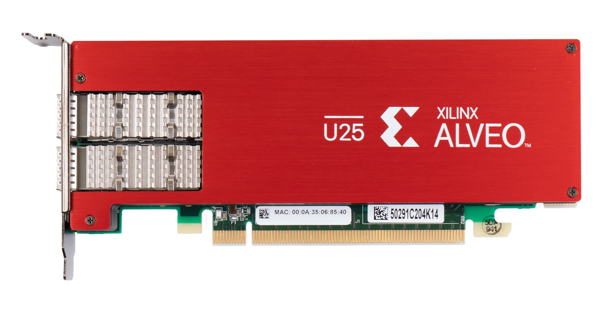
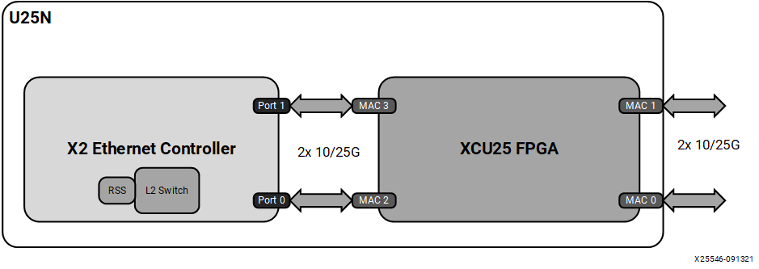

# Introduction

The Alveo™ U25N is a 2x10/25G SmartNIC. The
half-height, half-length (HHHL) Alveo U25N SmartNIC is compliant with
the PCI Express® Gen3 x8 (x16 connector). It features the Zynq®
UltraScale+™ XCU25 MPSoC and XtremeScale X2 Ethernet controller. The
Alveo U25N SmartNIC platform is based on a powerful FPGA, enabling
hardware acceleration and offload to happen inline with maximum
efficiency while avoiding unnecessary data movements and CPU
processing. It is composed of multiple software modules that contain
Ethernet drivers and control demons such as vswitchd and strongSwan.
This user guide describes installation, configuration, and operation
of the Alveo U25N SmartNIC, as well as its features, performance, and
diagnostic tools. For the U25N SmartNIC feature list, refer to the
[Alveo U25N page](https://www.xilinx.com/member/u25n-ea.html).

*Figure 1:* **Alveo U25N SmartNIC**

*Figure 2:* **U25N Architecture**

