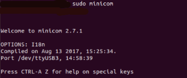
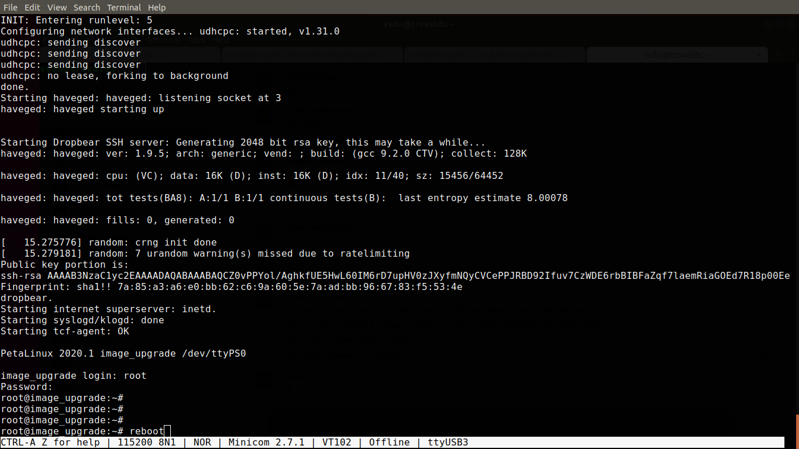
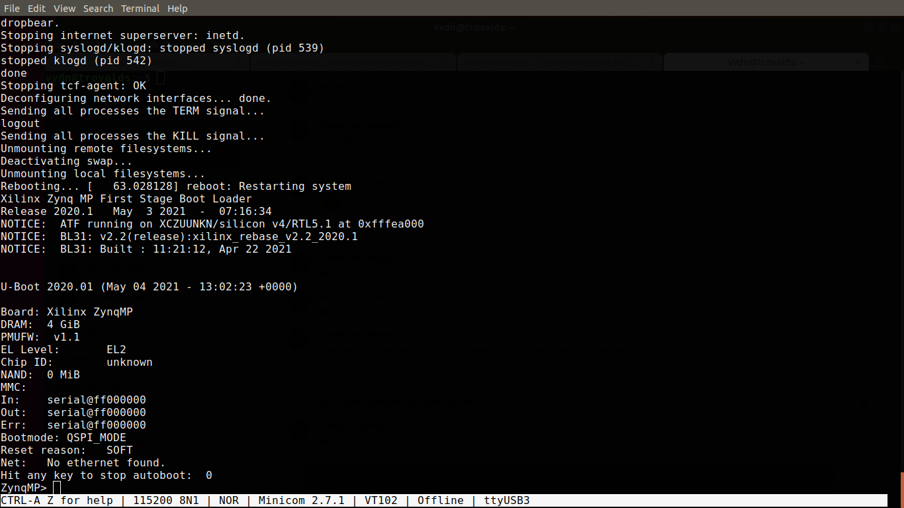
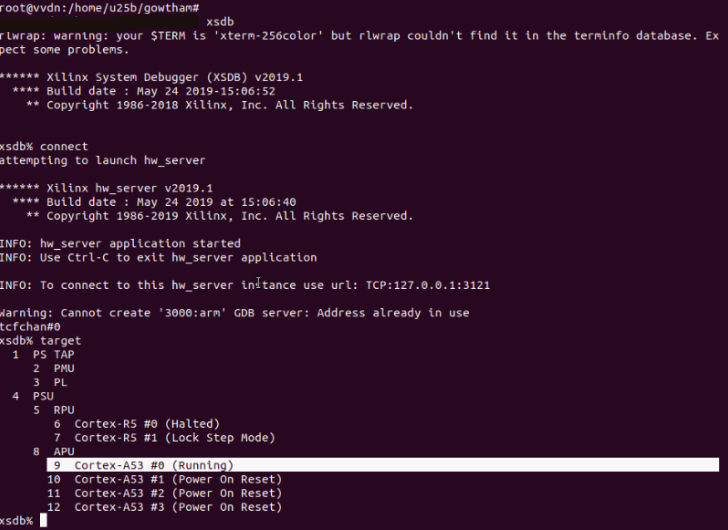
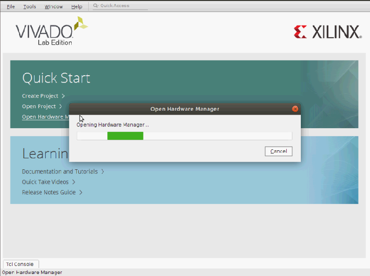
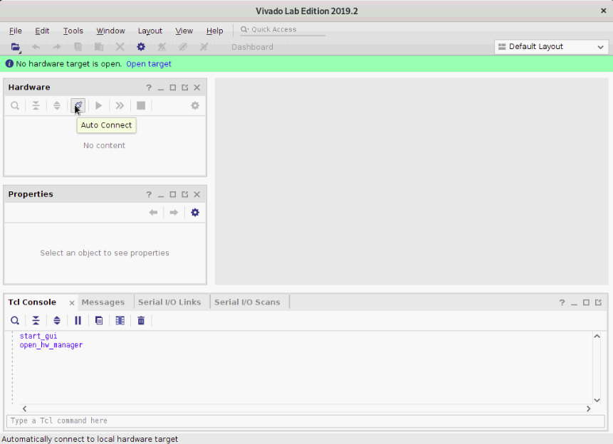
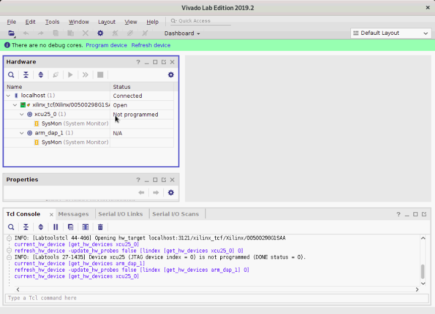
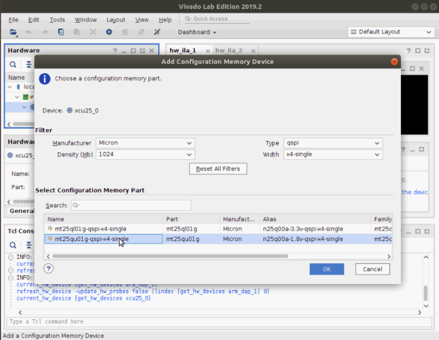
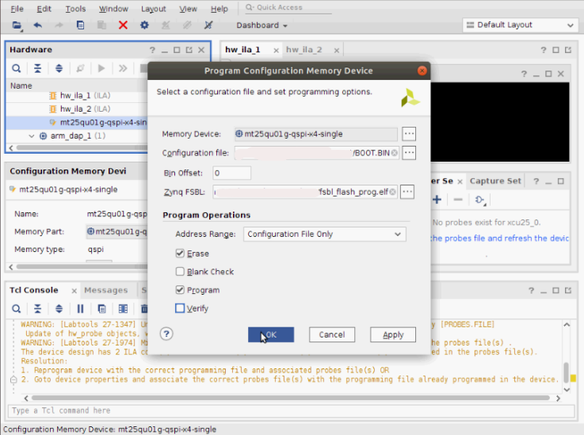
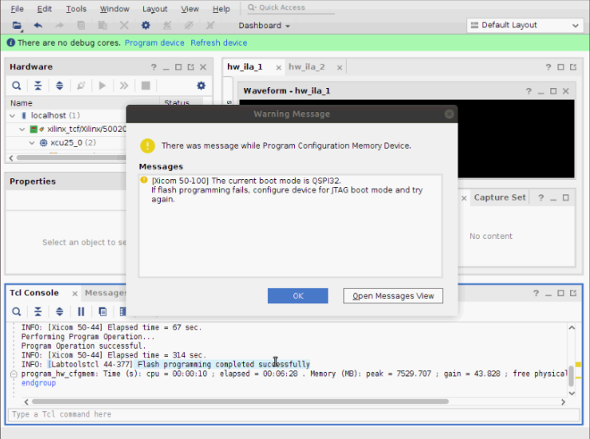

# U25N Shell Programming

To program the U25N flash, an Alveo™ programming cable is required. Refer to *Alveo Programming Cable User Guide* ([UG1377](https://www.xilinx.com/cgi-bin/docs/bkdoc?k=accelerator-cards%3Bd%3Dug1377-alveo-programming-cable-user-guide.pdf)) to connect the Alveo programming cable to the U25N maintenance connector. The Vivado® tools must be installed on the server to which the Alveo programming cable's USB port is connected. For more information, see [Vivado ML Overview](https://www.xilinx.com/products/design-tools/vivado.html).

## Entering into U-Boot Mode

***Note*:** There is no need to performing the first step when flashing the shell image for the first time.

1. Connect a USB cable to the SmartNIC.

   a. Open a command line terminal and run the minicom command with sudo.

   b. Before running minicom, verify the serial port setup configuration using the following steps:

      i. Pull up the settings using the -s option.

      ```
      sudo minicom -s
      ```

      This should bring up a colorful display listing the different settings.

      ii. To configure the serial port setup, arrow down to **Serial port setup** and press **Enter**.

      

      iii. To modify the different configurations, press the key corresponding to the setting. For example, press **A** to modify the path to the serial device. Press **Enter** to save the parameters for the setting.

      

      Make sure the above shown configuration is applied for E,F,G fields.

      iv. After you have saved the configuration, arrow down and select **Exit** to exit from minicom.

      v. Some logs will appear after executing the minicom command. These can be ignored. Run the command as shown in the following figure.

      

   c. When prompted for a login and password, enter the following:

      - login: root

      - password: root

      

   d. After logging in, do a reboot.

      The system starts executing the reboot command.

   e. When it displays autoboot, enter any key to get into U-Boot mode.

      

      

      

      Close the terminal after the above state occurs.

2. As a root, run the xsdb command from the Vivado tools directory in the <install_directory/Vivado_Lab/2019.2/bin> path.

   a. Type the `connect` command and check the target using the `target` command. Make sure that you get core 0 in running status and other cores in power-on reset.

      

   b. Exit xsdb by entering **exit** in the xsdb console.

3. Launch the Vivado tools. For example, you can enter the following:

   ```
   sudo <path>Vivado_Lab/2019.2/bin/vivado_lab
   ```

   This launches the Vivado software which is used to flash the FPGA image. After the Vivado software opens, carry out the following steps:

   a. After opening, click **Open Hardware Manager** in the Quick Start tab.

      

   b. Click **Auto Connect**.

      

   c. Verify whether the U25N SmartNIC is detected properly.

      

   d. Select the SmartNIC as shown below, right-click, and select **Add Configuration Memory Device**.

      

   e. Search by clicking **mt25qu01g-qspi-x4-single** in the Search tab.

      

   f. After making the above selections, a dialog box appears. Click **OK** and continue.

   g. Select the configuration file (`BOOT.BIN`), and first stage bootloader file (`fsbl_flash_prog.elf`).

   h. Uncheck Verify under Program operations. It will be time consuming otherwise.

      

   i. Click **OK**. The system begins programming.

      

   j. The programming takes 5 to 10 minutes. Upon successful completion of programming, the following output log appears. Click **OK**.

      

   k. If you exit the Vivado tools after the flash programming completes, the following logs appear. These can be ignored.

      

4. Power cycle the server (Power OFF and Power ON).
