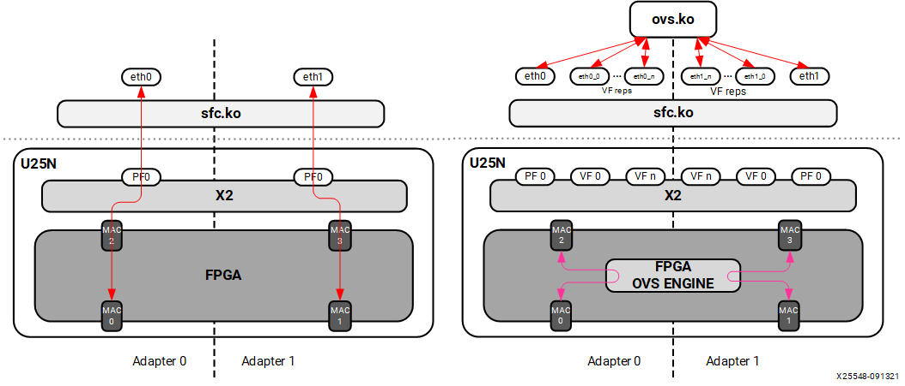

# 2 Supported Services

## 2.1 U25N Modes: Legacy and Switchdev Mode

The U25N SmartNIC can operate in two modes:

Switchdev Mode with Open vSwitch (OVS): This mode allows offloading the Linux kernel forwarding data plane to U25N SmartNIC.

Legacy Mode without OVS: In this mode, packets are forwarded in and out of the U25N SmartNIC without any modifications.

*Figure 3:* **U25N Modes of Operation**

## 2.2 Open vSwitch

Open vSwitch (OVS) is a software-defined virtual switch that a hypervisor uses to manage traffic between virtual instances. It performs not only classic layer-2 switching, but also supports arbitrarily complex rules matching on any packet field, and performing any transformation.

OVS groups packet flows requiring the same switching behavior into megaflows that can require filtering at layer 2, layer 3, or layer 4 (potentially changing over time) of the Network stack. Deployments can require very large numbers of simultaneous megaflows to be supported. The downside of OVS is that it is resource-intensive. Cloud providers have to dedicate a significant number of cores to run this infrastructure, instead of renting those cores to their customers for running business applications.The U25N SmartNIC can offload the virtual switching off of the host processor and hence improve CPU efficiency .

OVS supports various dataflows: port to VM, VM to VM, and port to port. The following section contains detailed information about these dataflows.

### 2.2.1 Port to Port

In this configuration, traffic flows from one physical port to the other physical port of the U25N SmartNIC and vice versa . The OVS datapath is offloaded to the SmartNIC, and the control path runs on the host. Initial incoming packets with no flow/entry in the OVS dataplane are forwarded up to the host(where vSwitchd daemon runs) for flow/rule learning. Subsequently, the flow/rules are propagated to the OVS dataplane present in the SmartNIC which handles further packet switching.

*Figure 4:* **OVS Offload Scenario**

### 2.2.2 Port to VM or VM to Port

In this configuration, traffic flows from the host or VMs to U25N physical ports, and vice versa. This configuration is achieved by creating virtual functions (VFs) corresponding to a physical function (PFs) using sfboot command (for more information refer to the Solarflare Server Adapter user guide at [Solarflare Server Adapter User Guide](https://www.xilinx.com/support/download/nic-software-and-drivers.html#drivers-software)). In this configuration packet switching is done by OVS.

### 2.2.3 VM to VM

In this configuration, traffic flows from a VM to another VM via OvS kernel module present in the SmartNIC. Packet switching is done by OvS in this configuration.

### 2.2.5 Supported Overlay Network protocols

#### 2.2.5.1 L2GRE

OVS supports layer 2 over generic routing encapsulation (L2GRE). L2GRE tunnel bridges two discrete LAN segments over the internet by creating a tunnel. At the origin of the tunnel, packets are encapsulated and at the terminating end, packets are decapsulated. The constant encapsulation and decapsulation puts a tremendous load on the host CPU.

With the help of hardware offload, packet encapsulation and decapsulation is offloaded to the U25N SmartNIC and does not consume valuable host CPU cycles.

#### 2.2.5.1 VXLAN

OVS supports Virtual eXtensible Local Area Network or VXLAN. VXLAN is an overlay network that transports an L2 network over an existing L3 network. For more information on VXLAN, please see RFC 7348. Like L2GRE the VXLAN tunnel creation and packet encapsulation/decapsulation process can be offloaded to the U25N Smart NIC, thus saving valuable CPU cycles.

### 2.2.6 LACP

Link aggregation is the combining of two 25Gbps links in parallel, in order to increase throughput beyond a single 25Gbps connection, to provide redundancy in case one of the links should fail, or both. PF bond and VF_Rep bond is added to the OvS bridge. 

### 2.2.7 VLAN Push/Pop

OVS supports offload of vlan header push/pop actions. 

- strip_vlan: Strips the VLAN tag from a packet. 
- push_vlan: Push a new VLAN tag onto the packet.

### 2.2.8 Conntrack

Conntrack is a connection tracking module for stateful packet inspection. OVS can use the connection tracking system to match on the TCP segments from connection setup to connection tear down where OpenFlow flow can be used to match on the state of the packet.

## 2.3 IPsec

Internet protocol security (IPsec) is a secure network protocol suite that authenticates and encrypts packets to provide a secure channel between two endpoints over an internet protocol network. Encrypted packets are forwarded to the CPU and handled by an open-source application called strongSwan (see [https://www.strongswan.org](https://www.strongswan.org/)). Due to the computing complexity of encryption and decryption of packets, handling IPsec in the host CPU consumes significant compute cycles. Offloading this operation to U25N hardware easily increases system-level throughput and lowers CPU utilization.

Currently, IPsec transport mode is supported in the gateway mode, i.e., traffic from one port is encrypted and sent to the other port.

## 2.4 Stateless Firewall

Stateless firewalls make use of a  packet's source, destination, and other parameters to figure out whether it presents a threat. Stateless firewall should be added on the ingress of ports so that filtering based on nftables rules can be applied. nftables is a subsystem of the Linux kernel providing filtering and classification of network packets/datagrams/frames.
First-level filtering is done based upon nftables rules. The hardware offload is available for nftables through the netdev family and the ingress hook. This also includes base chain hardware offloading.

## 2.5 DPDK on U25N

Data Plane Development Kit or DPDK is a kernel bypass technique to accelerate packet processing. DPDK enables the applications running in user-space to interact directly with NIC, bypassing the Linux kernel space. DPDK uses Poll Mode Driver (PMD) to interact with the underlying NIC. DPDK can be run on the X2 PF or VF. To run the testpmd/pktgen application on the U25N, refer to [Solarflare libefx-based Poll Mode Driver DPDK](https://doc.dpdk.org/guides/nics/sfc_efx.html#pre-installation-configuration). For more information about how to run DPDK on the U25N, refer to [DPDK](./ug1534-dpdk.html).

## 2.6 Statictics counter

Statistics data will be updated periodically from U25N hardware. Counts would be available for each service separately. Commands are provided to display the counter values.

## 2.7 Debug

A set of debug command is provided which collects
- debug logs from PS and send them to host CPU. 
- dump the default rules and offloaded rules of OVS.