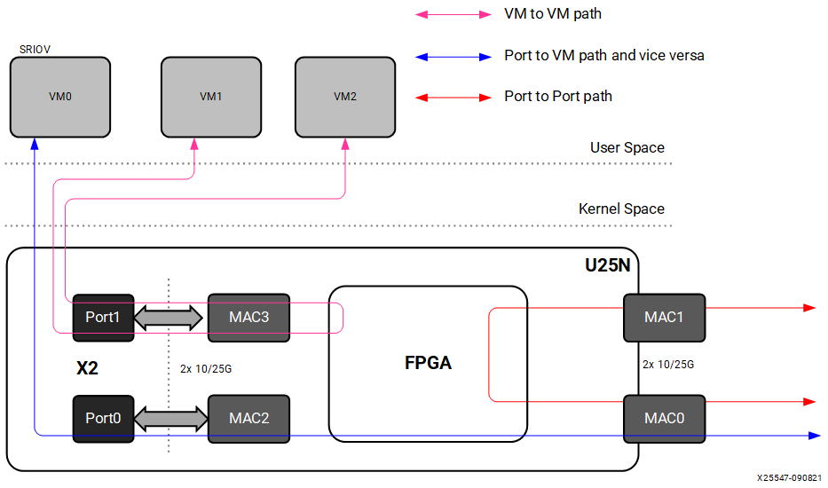

# Supported Services

## U25N Modes: Legacy and Switchdev Mode

The U25N SmartNIC supports two different modes of operation. One is a switchdev mode that enables Open vSwitch (OVS), and the other is a legacy mode without OVS. The basic operation is shown in the following figure, and more details are provided in Legacy and Switchdev Modes.

*Figure 3:* **U25N Modes of Operation**

## Open vSwitch

OVS is a multilayer software switch licensed under the open source Apache 2 license. The Alveo U25N SmartNIC implements a production quality Open vSwitch platform that supports standard management interfaces and offloads the forwarding functions to hardware. For more information about Open vSwitch, refer to [https://docs.openvswitch.org/en/latest/intro/what-is-ovs](https://docs.openvswitch.org/en/latest/intro/what-is-ovs).

OVS supports various dataflows---port to VM, VM to VM, and port to port. Details of these dataflows are presented in the following sections.

### Port to Port

In this scenario, traffic flows from one external network port to another external port, and vice versa. The OVS dataplane is offloaded to the SmartNIC, and the control plane is on the x86. If packets arrive without a proper flow/rule entry in the OVS dataplane, the initial few packets get forwarded to the x86. Then the OVS control plane adds an entry in the OVS dataplane of the SmartNIC based on the policy programmed. Subsequent packet switching is done by the SmartNIC OVS.

*Figure 4:* **OVS Offload Scenario**

### Port to VM or VM to Port

In this scenario, traffic flows from the host or VMs to any external ports, and vice versa. Create a virtual function (VF) corresponding to the physical function (PF) interface using the sfboot command (refer to the Solarflare user guide at [https://support-nic.xilinx.com/wp/drivers](https://support-nic.xilinx.com/wp/drivers)). Here, the packet switching is done by OVS.

### VM to VM

In this scenario, traffic flows from a VM to another VM via OVS in the SmartNIC. Create two VFs corresponding to the PF interface using the sfboot command. Here, the packet switching is done by OVS.

### L2GRE

OVS supports layer 2 over generic routing encapsulation (L2GRE). L2GRE is a mechanism that encapsulates the entire packet. The solution supports L2GRE encapsulation and decapsulation on U25N hardware.

### VXLAN

The solution supports VXLAN tunneling/de-tunneling. Tunnel interfaces
can be created using OVS. The tunnel process is offloaded on the U25N
hardware.

## IPsec

Internet protocol security (IPsec) is a secure network protocol suite that authenticates and encrypts packets to provide a secure channel between two endpoints over an internet protocol network. Control packets are forwarded to the CPU and handled by an open source application called strongSwan (see [https://www.strongswan.org](https://www.strongswan.org/)). Security association (SA) and security policy (SP) are added to the U25N hardware as flows using a plugin library linked to strongSwan through ioctls exposed from the U25N driver. Due to the computing complexity of encryption and decryption of packets, handling IPsec in the host CPU consumes significant compute cycles. Offloading this operation to U25N hardware easily increases system-level throughput and lowers CPU utilization.

Currently, IPsec transport mode is supported in the gateway mode, i.e., traffic from one port is encrypted and sent to the other port.

## Stateless Firewall

Stateless firewall should be added on the ingress of ports so that filtering based on nftables rules can be applied. First-level filtering is done based upon nftables rules. The hardware offload is available for nftables through the netdev family and the ingress hook. This also includes base chain hardware offloading.

## DPDK on U25N

Data Plane Development Kit (DPDK) can be run on the X2 PF or VF. To run the testpmd/pktgen application on the U25N, refer to [Solarflare libefx-based Poll Mode DriverDPDK](https://doc.dpdk.org/guides/nics/sfc_efx.html#pre-installation-configuration). For more information about how to run DPDK on the U25N, refer to [DPDK](./ug1534-dpdk.md).

## Statistics Counter

Statistics data is updated periodically from U25N hardware. Counters are available for each service separately.

## Debug

A debug command is provided to collect the debug logs from the processor subsystem (PS) on the FPGA and send them to the x86. Debug commands for verifying the default rules and offloaded rules from the x86 are provided.
